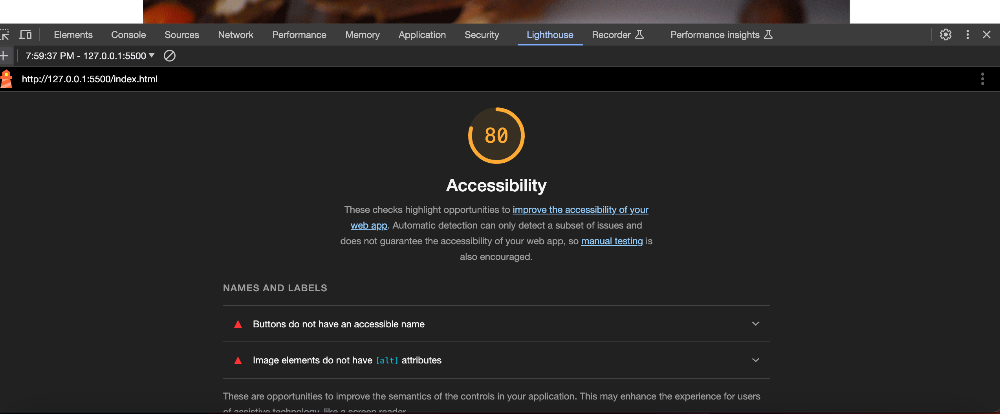

# Code 201 - Lab-10a

## Chocolate-Pizza

11.3.23

Using HTML and CSS, I built a single webpage based off of the provided design comp assets.

### Author: Stephanie G Johnson

### [Github Pages Link](https://stepheegee.github.io/chocolate-pizza)

### Links and Resources

[Google Fonts](https://fonts.google.com/specimen/Roboto+Condensed?preview.text=Choloate%20Pizza)

[Notebook Paper in CSS](https://css-tricks.com/how-to-create-a-notebook-design-with-css/)

### Lighthouse Accessibility Report Score

### Comments

Diagrammed the mockup to see how my CSS structure would look

Made my containers for the layout in CSS

Added the assets

Started adding the CSS code based on containers in html

Made labels and Input for the UL - I saw that a stretch goal is the make the UL actually check in JS. So I figured I would structure my html in preparation for that, if I were to make it that far. I did not.

How did this go, overall?

I didn't make it as far as I had hoped with this assignment. I designed how I wanted to structure the html, considering that I knew in CSS I would use flexbox or grid. So I made all the containers I thought that I would need, until I got into implementation with CSS and realized I had to do some restructuring in HTML. 

I tried to match the fonts as much as a I could. They don't really match. 

One place I errored is that I did not do my work on branches. So I went back and created a branch so that I have a record of the iterations. 

What observations or questions do you have about what you’ve learned so far?
I thought it was cool that you can make CSS look like notebook paper. I didn't execute it as well as I wanted to. But if I took more time, I probably could. 

How long did it take you to complete this assignment? And, before you started, how long did you think it would take you to complete this assignment?

I took 2 hours and 30 minutes for this assignment and didn't finish. I knew the amount of time allocated for this assignment up front because we were instructed. The 30 minutes extra was to draw my grid lines and look through the assets. 

